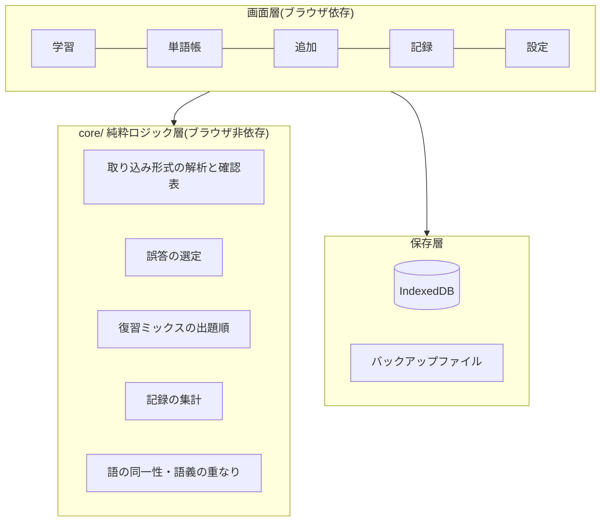

# 設計

授業(TOEIC 対策の英語講義)で、**受講者一人ひとりが自分の単語帳として使える**単語学習アプリ。
既存の個人用アプリ `toeic-drill` の `単語ドリル.html` をもとに、データ構造を「単語帳中心」に作り直す。

進捗はここに書かない。[50_Tasks.md](50_Tasks.md) を見る(UD-3)。

## 1. 決定表

| 状態 | 事項 | 内容 |
| --- | --- | --- |
| ◆ | 形態 | 個人用 `toeic-drill` は改修せず、新しいリポジトリ `tango-drill` に分ける |
| ◆ | 共通ルールの読み込み | 端末ごとの `CLAUDE.local.md`(git 管理外)から import する(CLAUDE.md 冒頭) |
| ◆ | 公開範囲 | 公開リポジトリ。個人情報を入れない |
| ◇ | 技術 | 静的 Web アプリ(PWA)+ GitHub Pages。サーバー・アカウントを持たない(推奨) |
| ◇ | 保存先 | 端末内(IndexedDB)+ バックアップファイルの書き出し・読み込み(推奨) |
| ◇ | 少語数の 4 択 | 誤答専用の内蔵語彙(既存の 495 項目)で不足分を補う。問題には出さない(推奨) |
| ◇ | サーバー・HTTP API(第 3 段階) | 第 1 段階の利用状況を見てから決める |
| ◇ | 内蔵語彙だけで補う境界の語数 | (仮)10。使いながら調整する |
| ◇ | ライセンス | 引き継ぎのために明記する。種類は未決定 |

## 2. 段階

| 段階 | 中身 |
| --- | --- |
| 第 1 段階 | 単語の追加・編集・削除、4 択(内蔵語彙で補完)・カード、記録、バックアップ、AI との往復(貼り付け)、PWA |
| 第 2 段階 | 教材セットの配布、提出用テキスト、日→英・例文穴埋め・スペル入力・読み上げ、共有メニューからの取り込み |
| 第 3 段階 | 同期用の小さなサーバー、HTTP API、MCP(個人情報の扱いが変わるので条件付き) |

## 3. 層の構成

- `core/` は Node.js だけで検査できる(UV-3)。ブラウザの API に触れないことを不変条件 `INV-6` として機械検査する
- ビルド工程を持たない。ES モジュールをそのまま配信し、型は JSDoc + `tsc` で検査だけする
- 不変条件の一覧は `CLAUDE.md` §3 にある(ここには再掲しない)

## 4. 既存アプリから引き継ぐもの

| 資産 | 出自(`単語ドリル.html`) | 移植先 |
| --- | --- | --- |
| 語の同一性 `見出し語 + 品詞` | `keyOf()` `normPos()` | `core/word.js` |
| 語義が重なる語を誤答にしない | `jaSenses()` `sensesOverlap()` | `core/word.js` |
| 品詞の分解 | `posParts()` | `core/word.js` |
| 2 段階クイズ(自己申告 → 選択) | `renderStage1()` `renderStage2()` | 画面層 |
| 回数ベースの復習ミックス | `qAgo()` `qMiss()` `qFew()` | `core/`(T-3) |
| 正誤の CSV 書き出し | `statsCsv()` | 提出用テキストの土台 |
| データの項目名 `en` `pos` `trans` `ja` `ex` `exJa` `note` | 単語データ全体 | 取り込み形式に引き継いだ。句表現の印 `kind` も引き継ぎ、`tags` `exSrc` を足した([20_ImportFormat.md](20_ImportFormat.md) §2) |

## 5. 検証

手段と回数の表は `CLAUDE.md` §1 にある。GitHub Actions(`.github/workflows/ci.yml`)が挙動・型・文書の 3 系統を push ごとに回す。
