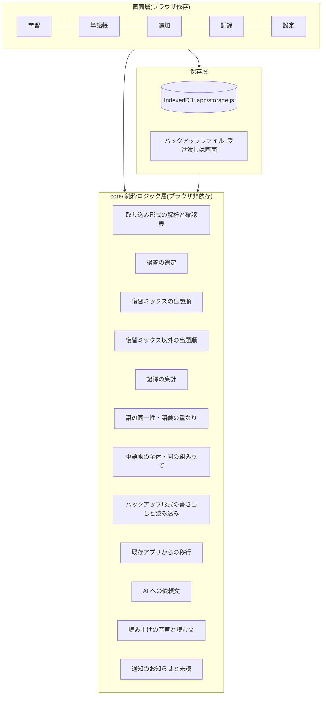

# 設計

授業(TOEIC 対策の英語講義)で、**受講者一人ひとりが自分の単語帳として使える**単語学習アプリ。
既存の個人用アプリ `toeic-drill` の `単語ドリル.html` をもとに、データ構造を「単語帳中心」に作り直す。

進捗はここに書かない。[50_Tasks.md](50_Tasks.md) を見る(UD-3)。

## 1. 決定表

| 状態 | 事項 | 内容 |
| --- | --- | --- |
| ◆ | 形態 | 個人用 `toeic-drill` は改修せず、新しいリポジトリ `tango-drill` に分ける |
| ◆ | 共通ルールの読み込み | 端末ごとの `CLAUDE.local.md`(git 管理外)から import する(CLAUDE.md 冒頭) |
| ◆ | 公開範囲 | 公開リポジトリ。個人情報を入れない |
| ◇ | 技術 | 静的 Web アプリ(PWA)+ GitHub Pages。サーバー・アカウントを持たない(推奨) |
| ◆ | 保存先 | 端末内(IndexedDB)+ バックアップファイルの書き出し・読み込み。下の 3 行(バックアップ形式・回・読み込み)の決定がこれを前提にしている |
| ◆ | バックアップ形式 | 封筒型の独自の版 `tango-drill-backup/vn`(版ごとの違いと今書き出す版は [22_Storage.md](22_Storage.md) §2。過去の版も読む。INV-3)。語は取り込み形式の語と同じ形で、追加日・記録・印は語の鍵で引く欄に置く。端末内の保存も同じ形([22_Storage.md](22_Storage.md) §2) |
| ◆ | 単語帳での「回」 | 同じ日に追加した語を 1 回とする。語ごとに追加日を保存する([21_Quiz.md](21_Quiz.md) §5) |
| ◆ | バックアップの読み込み | 確認表(INV-2)は通さず、件数を見せてから全体を置き換える。直前の単語帳を退避し、元に戻せる([22_Storage.md](22_Storage.md) §3) |
| ◆ | 既存アプリからの移行 | 既存の単語データと記録からバックアップのファイルを作り、バックアップの読み込みで入れる。追加日は単語データの日付を引き継ぐ(既存アプリの回がそのまま続く)。語の取り込み(確認表)では追加日と記録を運べないため。確認表を通さない理由は [22_Storage.md](22_Storage.md) §3、手順は §6 |
| ◆ | 読み上げ | ブラウザの音声合成で、端末内の音声(`localService`)だけを使う。インターネット経由の音声は読む文を外部へ送るので使わない(INV-1)。ブラウザと OS ごとの違いと規則は [24_Speech.md](24_Speech.md) |
| ◆ | 動詞の自他 | 既存アプリの `trans`(`vt` / `vi` / `vt/vi`)と印(他 / 自 / 他自)を引き継ぐ。簡易形式の列は増やさず(増やすと版が変わり、見出し行の無い入力を見分けられない)、品詞の欄に `動(他)` と添えて書く。依頼文は v2 でそう答えさせる。前から登録してある語には、自他だけを尋ねる依頼文の返答を確認表に通して補う(INV-2)([20_ImportFormat.md](20_ImportFormat.md) §2・§6) |
| ◆ | 通知タブ | 利用者に知らせるべき変更を載せる。重要なお知らせは読むまでタブのボタンに赤い点を出す。既読は端末ごとの設定に置く([25_Notices.md](25_Notices.md)) |
| ◇ | 少語数の 4 択 | 誤答専用の内蔵語彙(既存の単語データ。語数と項目は [21_Quiz.md](21_Quiz.md) §4)で不足分を補う。問題には出さない(推奨) |
| ◇ | サーバー・HTTP API(第 3 段階) | 第 1 段階の利用状況を見てから決める |
| ◇ | 自分の語だけで誤答を作る境界の語数 | 仮値で進める。値と見直す材料は [21_Quiz.md](21_Quiz.md) §3 |
| ◇ | ライセンス | 引き継ぎのために明記する。種類は未決定 |

## 2. 段階

| 段階 | 中身 |
| --- | --- |
| 第 1 段階 | 単語の追加・編集・削除、4 択(内蔵語彙で補完)・カード、記録、バックアップ、AI との往復(貼り付け)、PWA、読み上げ(経緯は [50_Tasks.md](50_Tasks.md) の T-5.6)、動詞の自他と通知タブ(T-5.7) |
| 第 2 段階 | 教材セットの配布、提出用テキスト、日→英・例文穴埋め・スペル入力、共有メニューからの取り込み |
| 第 3 段階 | 同期用の小さなサーバー、HTTP API、MCP(個人情報の扱いが変わるので条件付き) |

## 3. 層の構成

```mermaid
flowchart TB
  subgraph UI["画面層(ブラウザ依存)"]
    A[学習] --- B[単語帳]
    B --- C[追加]
    C --- D[記録]
    D --- E[設定]
  end
  subgraph CORE["core/ 純粋ロジック層(ブラウザ非依存)"]
    P[取り込み形式の解析と確認表]
    Q[誤答の選定]
    R[復習ミックスの出題順]
    O[復習ミックス以外の出題順]
    S[記録の集計]
    T[語の同一性・語義の重なり]
    K[単語帳の全体・回の組み立て]
    V[バックアップ形式の書き出しと読み込み]
    M[既存アプリからの移行]
    G[AI への依頼文]
    W[読み上げの音声と読む文]
    N[通知のお知らせと未読]
  end
  subgraph STORE["保存層"]
    I[(IndexedDB: app/storage.js)]
    F[バックアップファイル: 受け渡しは画面]
  end
  UI --> CORE
  UI --> STORE
  STORE --> CORE
```

- `core/` は Node.js だけで検査できる(UV-3)。ブラウザの API に触れないことを不変条件 `INV-6` として機械検査する
- ビルド工程を持たない。ES モジュールをそのまま配信し、型は JSDoc + `tsc` で検査だけする
- 保存層は `core/` のバックアップ形式で読み書きする(保存の形とバックアップの形は同じ。[22_Storage.md](22_Storage.md) §4)
- ブラウザの API を使うコード(保存層・画面)は `app/` に置き、型は DOM を含む `tsconfig.app.json` で検査する。
  `core/` は DOM を含まない `tsconfig.json` で検査する([52_Pitfalls.md](52_Pitfalls.md) P-1)
- 不変条件の一覧は `CLAUDE.md` §3 にある(ここには再掲しない)

## 4. 既存アプリから引き継ぐもの

| 資産 | 出自(`単語ドリル.html`) | 移植先 |
| --- | --- | --- |
| 語の同一性 `見出し語 + 品詞` | `keyOf()` `normPos()` | `core/word.js` |
| 語義が重なる語を誤答にしない | `jaSenses()` `sensesOverlap()` | `core/word.js` |
| 品詞の分解 | `posParts()` | `core/word.js` |
| 4 択の誤答の選定 | `quizOptions()` | `core/distractors.js`。内蔵語彙による補完と品詞の一致を足した([21_Quiz.md](21_Quiz.md) §2) |
| 2 段階クイズ(自己申告 → 選択) | `renderStage1()` `renderStage2()` | 判定と記録は `core/review.js`(`stage1Record` `stage2Judge`。[21_Quiz.md](21_Quiz.md) §6)、表示は `app/tabs/study.js` |
| 回数ベースの復習ミックス | `qAgo()` `qMiss()` `qFew()` `buildQuiz()` | `core/review.js`([21_Quiz.md](21_Quiz.md) §5) |
| 正誤の記録と集計 | `recordAnswer()` `answerPairs()` `statOf()` | `core/review.js`([21_Quiz.md](21_Quiz.md) §6) |
| 正誤の CSV 書き出し | `statsCsv()` | `core/review.js`。提出用テキストの土台 |
| データの項目名 `en` `pos` `trans` `ja` `ex` `exJa` `note` | 単語データ全体 | 取り込み形式に引き継いだ。句表現の印 `kind` も引き継ぎ、`tags` `exSrc` を足した([20_ImportFormat.md](20_ImportFormat.md) §2) |
| 動詞の自他の印(他 / 自 / 他自)と訳語のラベル(`(名)` `(他)` など) | `transBadge()` `jaHtml()`・学習計画の訳語の規約 | `app/wordForm.js`(`transBadge` `jaHtml`)。自他を持つ語の判定は `core/word.js`(`isVerb`)。訳語の規約は依頼文 v2 が AI に頼む([20_ImportFormat.md](20_ImportFormat.md) §6) |

## 5. 検証

手段と回数の表は `CLAUDE.md` §1 にある。GitHub Actions(`.github/workflows/ci.yml`)が挙動・型・文書の 3 系統を push ごとに回す。
