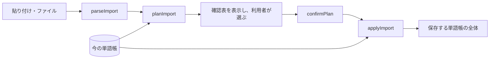

# 取り込み形式

単語を外からアプリへ渡すときの形式と、取り込み前の確認表の規則。第 1 段階ではこの形式が「API の本体」に当たる
(経路は貼り付け・ファイル。HTTP API は第 3 段階で条件付き。[10_Design.md](10_Design.md) §2)。

| 実装 | 役割 |
| --- | --- |
| `core/importFormat.js` | 解析と検証(`parseImport`) |
| `core/importPlan.js` | 確認表(`planImport` → `confirmPlan` → `applyImport`) |
| `tests/core/fixtures/import/` | 各版の見本と、わざと壊した見本(`broken/`) |

進捗はここに書かない。[50_Tasks.md](50_Tasks.md) を見る(UD-3)。

## 1. 版(INV-3)

| 版 | 見分け方 | 主な用途 | 見本 |
| --- | --- | --- | --- |
| `simple/v1` | §3 の「JSON として読む条件」に当たらない入力すべて | 貼り付け・AI の返答・表計算からのコピー | `simple_v1.txt` |
| `tango-drill/v1` | JSON の `format` 欄 | ファイルでの受け渡し・教材セット・バックアップの単語部分 | `tango-drill_v1.json` |
| `toeic-drill` | `format` 欄の無い JSON | 既存の単語データの移行(T-8)・内蔵語彙(T-2.1) | `toeic-drill.json` |

- **一度読めるようにした版の読み手は消さない。** `tests/core/importVersions.test.js` の `EVER_READABLE` が、
  版の一覧と見本を突き合わせる
- 版を足すときは、次の 4 つを同時に足す: 読み手(`core/importFormat.js`)・見本(`tests/core/fixtures/import/`)・
  `EVER_READABLE` の行・この表の行
- アプリより新しい版(`tango-drill/v2` 以降)は「アプリを更新してください」と拒否する。不明な `format` も拒否する
- 簡易形式は見出し行を持たないので、**見出し行の無い入力は今後も `simple/v1` として読む。**
  列の並びを変えるときは、先頭行などで見分けられる新しい版にする
- 書き出すときは常に `tango-drill/v1`(`CURRENT_JSON_FORMAT`)を使う

## 2. 語の項目

項目名は toeic-drill の単語データの 7 項目と、そのアプリが句表現に付けていた `kind` を引き継ぎ([10_Design.md](10_Design.md) §4)、
`tags` と `exSrc` を足した。
空文字列と JSON の `null` は「項目が無い」と同じに扱う。

| 項目 | 必須 | 内容と正規化 |
| --- | --- | --- |
| `en` | 必須 | 見出し語。英字を含み、かな・漢字・全角文字を含まない。前後の空白を落とし、連続する空白を 1 つにする。大文字・小文字は変えない(§5) |
| `pos` | | 品詞。`名` `動` `形` `副`、複数は `名/動`、句は `動詞句` など。別名(`noun` `n.` `名詞` `verb` `adj` `adverb` `phrase` など)は略号に揃える。句と括弧書きはそのまま |
| `trans` | | 動詞の自他。`vt` / `vi` / `vt/vi`。大文字と空白は揃え、`vi/vt` は `vt/vi` にする |
| `ja` | | 日本語の意味 |
| `ex` | | 英語の例文 |
| `exJa` | | `ex` の和訳。**例文の無い和訳は捨てる**(どの文の訳か判らないため) |
| `note` | | 補足 |
| `kind` | | `phrase` のみ。品詞に「句」を含む語は、`kind` が無くても(使えない値で捨てた場合も)`phrase` にする |
| `tags` | | 文字列の配列。前後の空白を落とし、空のタグと重複を除く |
| `exSrc` | | `ex` の出どころ。`self`(自作)/ `ai`(AI 生成)/ `set`(教材セット)。**例文の無い出どころは捨てる** |

- 項目ごとの検証では、**`en` の不備だけがその語を取り込まない理由になる**。
  そのほかに語を取り込まない場合は、§3(項目が多すぎる行・語が JSON のオブジェクトでない)と §4(重複)にある
- `en` 以外の項目の不備(使えない値・型の違い)と未知の項目は、その項目だけを捨てて警告を出す。1 項目のために語ごと落とさない

## 3. 各形式

### JSON として読む条件

次のどちらかに当たる入力を JSON として読み、`format` 欄で版を決める。当たらなければ `simple/v1` として読む。

1. 前後の空白を除いた入力が `{` で始まる
2. コードブロックのうち、言語名が `json` か、中身が `{` で始まるものがある(**最初の 1 つ**を読む)。
   コードブロックに入っていれば、前置きの文つきの AI の返答でも読める

- **構文の壊れた JSON は全体を拒否する。** 簡易形式として読み直さない(読み直すと、壊れた JSON の断片が見出し語として並ぶ)
- 語が 1 つも無い JSON は拒否せず、警告を出す(空の単語帳を書き出したファイルも読めるように。INV-3)
- `[` で始まる入力は JSON として扱わない(簡易形式として読む)

### `simple/v1`(簡易形式)

1 行 1 語。項目の並びは次の順で固定し、後ろの項目は省略できる。途中を空けるときは区切りだけを置く。

| 順 | 項目 |
| --- | --- |
| 1 | `en`(見出し語) |
| 2 | `pos`(品詞) |
| 3 | `ja`(日本語の意味) |
| 4 | `ex`(英語の例文) |
| 5 | `exJa`(例文の和訳) |
| 6 | `note`(補足) |

```text
allocate | 動 | 割り当てる | The manager allocated the budget. | 部長が予算を割り当てた。 | allocate A to B
reimburse | 動 | 払い戻す
itinerary
secure | | 守る
```

- `trans` `tags` `exSrc` は簡易形式では書けない。`kind` は品詞から決まる(§2)。
  出どころとタグは取り込みの既定として確認表に渡せる(§4)
- 区切りは半角 `|`・全角 `｜`・タブ。縦棒のある行は縦棒で区切る
- 行の先頭と末尾の縦棒は落とす(項目を持たないため)
- 項目が 7 つ以上ある行は読めない行にする(列がずれている恐れがある)

AI の返答をそのまま貼れるよう、次のものを読み飛ばす(寛容な解析)。

| 対象 | 扱い |
| --- | --- |
| 空行・コードブロックの囲み(`` ``` `` `~~~`)・Markdown の表の区切り行 | 行として数えない |
| 行頭の記号・番号(`- ` `* ` `+ ` `・` `•` `1.` `1)` `(1)` `①` など) | 落として読む |
| 項目を囲む強調・コード記号(`**` `__` バッククォート) | 落として読む |
| 見出し行: 項目名(`見出し語` `品詞` `意味` `Headword` `POS` `Meaning` など。一覧は §5)が 2 つ以上並び、2 つ目の項目が空でも品詞(§5)でもない行 | 読み飛ばし、確認表に「語ではない行」として出す |
| 区切りの無い行のうち、日本語を含む・英字が無い・`:` `!` `?` のどれかを含む・`.` で終わり 3 語以上・語数の上限(§5)を超えるもの | 前置きの文とみなして読み飛ばし、確認表に出す |
| 区切りの無い、上に当たらない行 | 見出し語だけの行として読む |
| 区切りのある行で、見出し語が英語でないもの | 読めない行にする |

- 見出し行の判定で 2 つ目の項目を見るのは、`meaning | 名 | 意味` のような本物の語を見出し行と取り違えないため
- ⚠ 句読点の無い短い英文(`What do you think` など)は見出し語として読んでしまう。確認表(§4)で利用者が外す前提である

### `tango-drill/v1`(JSON)

```json
{
  "format": "tango-drill/v1",
  "words": [
    { "en": "allocate", "pos": "動", "trans": "vt", "ja": "割り当てる", "exSrc": "ai", "tags": ["第3週"] },
    { "en": "itinerary" }
  ]
}
```

- 最上位は `format` と `words` だけ。他の項目は捨てて警告を出す

### `toeic-drill`(既存の単語データ)

`format` 欄の無い JSON を、toeic-drill の単語データの形(`words` と `phrases` の配列)として読む。

- `phrases` の語は、`kind` の値や品詞にかかわらず `phrase` にする
- `words` も `phrases` も無いものは拒否する。どちらかがあれば、空でも読む(語 0 件の警告を出す)
- 最上位の `date` `level` `theme` は使わずに捨てる。それ以外の未知の項目は捨てて警告を出す
- 単語データのファイルを包む `window.__addVocab(...)` は外さない。移行(T-8)の側で外してから渡す

## 4. 確認表(INV-2)

**取り込みは必ず確認表を経てから保存する。** 解析結果を直接保存する経路を持たない。



- 保存に渡す単語帳を返すのは `applyImport` だけ。`applyImport` は `confirmPlan` が返したものしか、
  `confirmPlan` は `planImport` が作ったものしか受け付けない。どちらもモジュールの中だけで登録しており、
  形を真似たもの・写しは拒否する
- `planImport` が返す確認表は凍結されている。利用者の選択は確認表を書き換えずに `confirmPlan` へ渡す
- 確認表を作ったあとに単語帳が変わっていたら保存しない(作り直させる)
- 画面が必ず確認表を通すことは T-5.1 で確かめる。バックアップの読み込みを確認表に通すかは T-4 で決める

### 行の種類

| 行 | 意味 | 既定 | 選べること |
| --- | --- | --- | --- |
| `add` | 新しい語として足す | 足す | 外す |
| `merge` | 既存の語の空欄を埋める。食い違う項目があれば並べて示す | 空欄だけ埋め、食い違いは単語帳の値を残す | 外す / 食い違いも上書きする(食い違いがあるときだけ) |
| `same` | 既存の語と同じ | 何もしない | なし |
| `ambiguous` | 品詞が無く、同じ綴りの語が複数ある。候補ごとに、当てたら埋まる項目と食い違う項目を示す(`previews`) | 取り込まない | 当てる語を候補から選ぶ(空欄だけ埋める)/ 新しい語として足す |
| `duplicate` | 同じ入力の中で先に出た語と重なる | 取り込まない | なし |
| `error` / `skipped` | 読めない行 / 語ではない行 | 取り込まない | なし |

### 既存の語への当て方

1. 語の同一性の鍵(`見出し語 + 品詞`、INV-4)が一致する語に当てる
2. 入力に品詞が無いとき: 同じ綴りの語が 1 つならそれに当てる。複数なら `ambiguous`、無ければ新しい語
3. 入力に品詞があり鍵が一致しないとき: 同じ綴りで**品詞の無い**語が 1 つなら、それの品詞を埋める。それ以外は新しい語
   (`secure` 形 があるところへ `secure` 動 を入れると、別の語として足す)

- 見出し語は大文字・小文字を区別して比べる(§5。鍵と同じ規則)
- 重複の判定: 足す語と `ambiguous` の語は「足したときの鍵」で、当てる語は「当て先の鍵」で、入力の中の先の行と比べる。
  重なれば後の行を `duplicate` にする
- 確定時に、`ambiguous` で選んだ当て先が他の行の当て先と重なれば拒否する(1 つの語に当てる行は 1 つだけ)
- 保存時にも、足す語の鍵が単語帳に既にあれば拒否する(防御。上の判定を通った確認表では起きない)
- 品詞を埋めると語の鍵が変わる。`applyImport` は変わった鍵の組(`rekeys`)を返し、保存層はそれで記録を付け替える(T-4.1)

### 重ね方

- 空欄は入力の値で埋める。**値が食い違う項目は、上書きを選んだ行だけ入力の値にする**(自作の例文を AI の出力が黙って消さない)
- 品詞は上書きしない(鍵が同じ語にしか当てないので、食い違うのは括弧書きの違いだけ)
- **例文(`ex`)・和訳(`exJa`)・出どころ(`exSrc`)は一組で動く**
  - 単語帳に例文が無いか、例文が食い違って上書きを選んだとき: 3 つとも入力の値にする(入力に和訳・出どころが無ければ消す)
  - 例文が食い違い、上書きを選ばないとき: 3 つとも単語帳の値を残す(入力の和訳は、別の文の訳なので使わない)
  - 例文が同じとき: 和訳だけを、空欄なら埋め、食い違えば上書きを選んだときだけ入れ替える
  - 単語帳の側でも、例文の無い和訳・出どころは持たない前提とする(持っていると、例文を埋めるときに黙って消える)。
    画面の編集(T-5)でもこれを守る
- `tags` は常に足し合わせる(減らさない)
- 取り込みの既定として次の 2 つを渡せる
  - 例文の出どころ(AI との往復なら `ai`、教材セットなら `set`)。例文があって出どころの無い語にだけ付ける
  - 全語に足すタグ(教材セットの名前など)

## 5. 仮の値

| 事項 | 今の値 | 見直す材料 |
| --- | --- | --- |
| 区切りの無い行を見出し語とみなす語数の上限 | (仮)6 語 | 実際の AI の返答(T-6)で、句表現が落ちる・前置きを拾う例が出たら |
| 見出し語の大文字・小文字 | (仮)区別する | 文頭を大文字にした AI の返答が別の語として足される例が出たら |
| 見出し行とみなす項目名 | (仮)`core/importFormat.js` の `HEADER_LABELS` | 実際の AI の返答(T-6) |
| 品詞とみなす値(見出し行の判定) | (仮)`POS_LIKE`: 1 字の略号 `名` `動` `形` `副` `前` `接` `代` `間` `冠` `助` か「〜句」を区切りで並べたもの。別名(`POS_ALIASES`)は略号に揃えてから比べる | 実際の AI の返答(T-6) |
