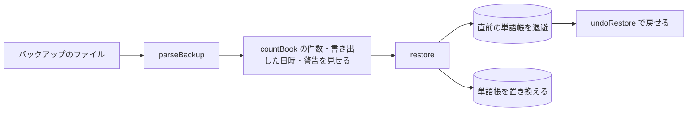

# 保存とバックアップ

単語帳を端末に置く方法(保存層)と、端末の外へ持ち出す方法(バックアップ)。
語を足す経路(取り込み)は [20_ImportFormat.md](20_ImportFormat.md)、回と記録の使い方は [21_Quiz.md](21_Quiz.md)。

| 実装 | 役割 |
| --- | --- |
| `core/book.js` | 単語帳の全体の形(`Book`)と、それに対する操作(`moveKeys` `importIntoBook` `sessionsOf` `countBook`) |
| `core/backup.js` | バックアップ形式の書き出し(`toBackup` `backupText`)と読み込み(`parseBackup` `readBackup`) |
| `app/storage.js` | IndexedDB への保存・読み込み・復元・元に戻す(`openStorage`)。ブラウザの API を使うので `core/` の外 |
| `Tools/Dev/serve.mjs` | ブラウザで確かめるための静的サーバー |
| `tests/core/fixtures/backup/` | バックアップの各版の見本 |

進捗はここに書かない。[50_Tasks.md](50_Tasks.md) を見る(UD-3)。

## 1. 単語帳の全体(`Book`)

| 項目 | 中身 |
| --- | --- |
| `words` | 語の一覧。語の項目は [20_ImportFormat.md](20_ImportFormat.md) §2 |
| `added` | 語の鍵 → 追加した日(YYYY-MM-DD)。**単語帳のどの語も持つ。** 回はこれで束ねる([21_Quiz.md](21_Quiz.md) §5) |
| `records` | 語の鍵 → 正誤と自己申告([21_Quiz.md](21_Quiz.md) §6)。単語帳から消した語の記録も残りうる |
| `starred` | 印を付けた語の鍵 |

- 語以外の項目は、語の鍵(INV-4)で引く
- 消した語の記録を残すのは、同じ鍵の語を足し直したときに記録がまた付くようにするため。
  追加日と印は単語帳にある語の分だけを持つ

## 2. バックアップ形式(INV-3)

語の部分は取り込み形式 `tango-drill/v1` の語と同じ形で書き、同じ読み手(`readItem`)で読む。
追加日・記録・印は語の鍵で引く別の欄に置く(封筒型)。

| 版 | 見本 |
| --- | --- |
| `tango-drill-backup/v1` | `tango-drill-backup_v1.json` |

| 欄 | 必須 | 中身 |
| --- | --- | --- |
| `format` | 必須 | 版 |
| `exportedAt` | | 書き出した日時(ISO 8601)。復元の前の確認に出す |
| `words` | 必須 | 語の配列 |
| `added` | | 語の鍵 → YYYY-MM-DD |
| `records` | | `{ "hist": { 鍵: [0/1, ...] }, "self": { 鍵: [0/1, ...] } }` |
| `starred` | | 鍵の配列 |

- 版の運用は取り込み形式と同じ([20_ImportFormat.md](20_ImportFormat.md) §1)。
  読み手を消さない・版を足すときは読み手と見本と `tests/core/backup.test.js` の `EVER_READABLE` とこの表を同時に足す・
  アプリより新しい版は「アプリを更新してください」と拒否する
- 書き出すときは常に `CURRENT_BACKUP_FORMAT` を使う

### 読み込みの規則

**全体を置き換える操作なので、1 か所でも信用できない箇所があれば全体を読まない。**
細部の不備は、その部分だけを捨てて警告を出す。

| 入力 | 扱い |
| --- | --- |
| 波括弧で始まらない入力(簡易形式・コードブロックで囲んだ AI の返答など)・`format` の無い JSON・語の取り込みの形式 | 読まない。取り込みへ案内する |
| 波括弧で始まるが JSON として読めない入力 | 読まない(壊れたバックアップとして知らせる) |
| `words` が配列でない・読めない語が 1 つでもある・鍵が重なる語がある(INV-4) | 読まない |
| 未知の欄(最上位と `records` の中)・あって読めない `exportedAt` | 無視して警告(`exportedAt` が無いだけなら警告しない) |
| 日付として読めない追加日・単語帳に無い語の追加日と印 | その分を捨てて警告 |
| 追加日の無い語 | 読み込んだ日に追加したものとして警告 |
| 0 と 1 以外を含む記録 | その語の記録を捨てて警告 |
| 直近 `KEEP` 件より長い記録 | 直近 `KEEP` 件にする |
| 読み手の正規化(品詞の別名など)で鍵が変わる語 | 追加日・記録・印も新しい鍵へ移す(書き出した版と今の版で**読み手の正規化**の規則が違っても記録を失わない) |

- 付け替え前の鍵は、ファイルに書かれた値に**今の** `keyOf` を当てて作る。守れるのは読み手の正規化の違いだけで、
  **鍵の規則そのもの(`keyOf` / `normPos`)を変えると、古いバックアップの記録・追加日・印は語から外れる。**
  鍵の規則を変えるときは、新しいバックアップの版を作り、古い版の読み手に旧い鍵から新しい鍵への変換を持たせる
  (見直し予定の見出し語の大文字・小文字の扱い([20_ImportFormat.md](20_ImportFormat.md) §5)がこれに当たる)

## 3. 復元(バックアップの読み込み)

**確認表(INV-2)は通さない。件数を見せて確認してから、単語帳の全体を置き換える。元に戻せる。**

- 確認に出す件数は `countBook`。**記録件数は正誤の記録の総数**(消した語の記録も数える)
- `restore` は、今の単語帳の退避と置き換えを 1 つのトランザクションで行う(途中で止まっても片方だけにならない)
- 退避は次の復元まで残す。`undoRestore` は退避した単語帳に戻して退避を消す。**復元のあとの変更は消える**(画面はこれを知らせる)
- 復元の直前に何も保存されていなかった場合、元に戻すと何も保存されていない状態(空の単語帳)に戻る
- 語の取り込みと混ぜる(2 台の端末の単語帳を 1 つにまとめる)操作は持たない。必要になったら、語の部分を確認表に通す別の操作として足す

## 4. 保存層(IndexedDB)

| 項目 | 値 |
| --- | --- |
| データベース | `tango-drill`(版 1) |
| オブジェクトストア | `kv`(キーは外から与える) |
| キー `book` | 今の単語帳。**バックアップと同じ形**(`toBackup`) |
| キー `undo` | 復元の直前の単語帳(同じ形)。直前に何も保存されていなければ `null` |
| キー `settings` | 端末ごとの設定(`loadSettings` / `saveSettings`)。バックアップには入れない。無い項目・型の違う項目は既定値(`DEFAULT_SETTINGS`)で補う |

- **保存した中身もバックアップの読み手(`readBackup`)で読む。** 保存の形とバックアップの形を 1 つにして、
  保存した中身も INV-3 の対象にする(アプリを更新しても、端末に残った単語帳を読める)
- **保存してある中身が読めなければ、空の単語帳として扱わずに知らせる。** 空として扱うと、次の保存で上書きして失う
- 語の鍵が変わるとき(取り込みで品詞が埋まる・読み手の正規化)は `moveKeys` で追加日・記録・印を移す(T-4.1)。
  移し先に消した語の記録が残っていれば、移してきた記録で置き換える(移す元に記録が無ければ、残っていた記録がそのまま付く)。
  **正誤と自己申告は 1 組で置き換える**(片方だけ置き換えると、末尾から対にしたとき([21_Quiz.md](21_Quiz.md) §6)の対応が崩れる)
- 新しく足した語の追加日は、取り込んだ日(`importIntoBook` の `today`)

## 5. 検証

| 対象 | 手段 |
| --- | --- |
| 形式・往復・読めないものの扱い | `tests/core/backup.test.js`(陽性対照つき) |
| 回・取り込みの反映・鍵の付け替え | `tests/core/book.test.js` |
| 保存・復元・元に戻す | `tests/app/storage.test.js`(IndexedDB は `fake-indexeddb` で代える) |
| 実際のブラウザでの往復 | 下の手順(別オリジンは別の IndexedDB を持つので、別のブラウザの代わりになる)。ファイルの受け渡しを画面で行う確認は [23_Screens.md](23_Screens.md) §6(Playwright。別のブラウザコンテキストへ渡す)。別の製品のブラウザ(iOS Safari)との受け渡しは [50_Tasks.md](50_Tasks.md) の T-5.2 |

### 実際のブラウザでの往復の手順

1. `node Tools/Dev/serve.mjs` で静的サーバーを立てる(127.0.0.1:8765。ビルド工程は無い)。
   `/` ではアプリが開く。手順はそのページのコンソールで行う(アプリと同じ IndexedDB を使うので、そのオリジンの単語帳は書き換わる)。
   `localhost` で開けない環境では、`node Tools/Dev/serve.mjs 8766` でもう 1 つ立て、ポートの違いで別オリジンにする
2. `http://localhost:8765/` を開き、開発者ツールのコンソールで `/app/storage.js` と `/core/` の各モジュールを動的 import する。
   取り込み(`importIntoBook`)で語を足し、`recordAnswer` で記録を付けて `save` する。開き直して `load` し、`backupText` で書き出す
3. `http://127.0.0.1:8765/` を開き(別オリジン)、`load` が空の単語帳を返すことを確かめる(陽性対照: 別の IndexedDB であること)。
   別の単語帳を `save` してから、2 の文字列を `parseBackup` → `countBook` → `restore` の順に通す
4. `load` の `countBook` が、手順 2 で書き出した単語帳の `countBook` と一致すること・`undoRestore` で 3 で保存した単語帳に戻ること・リロード後も残ることを確かめる
